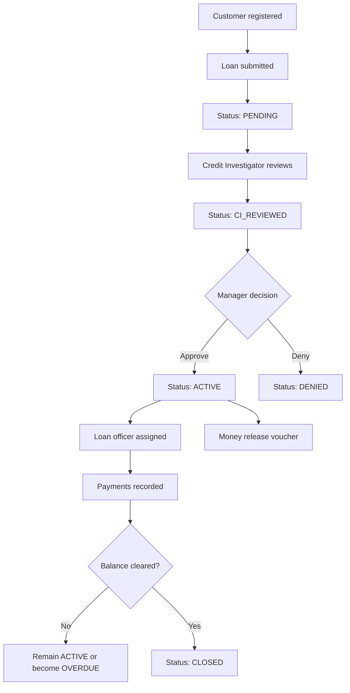
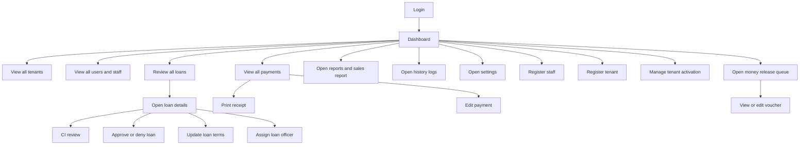
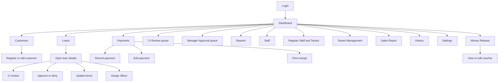
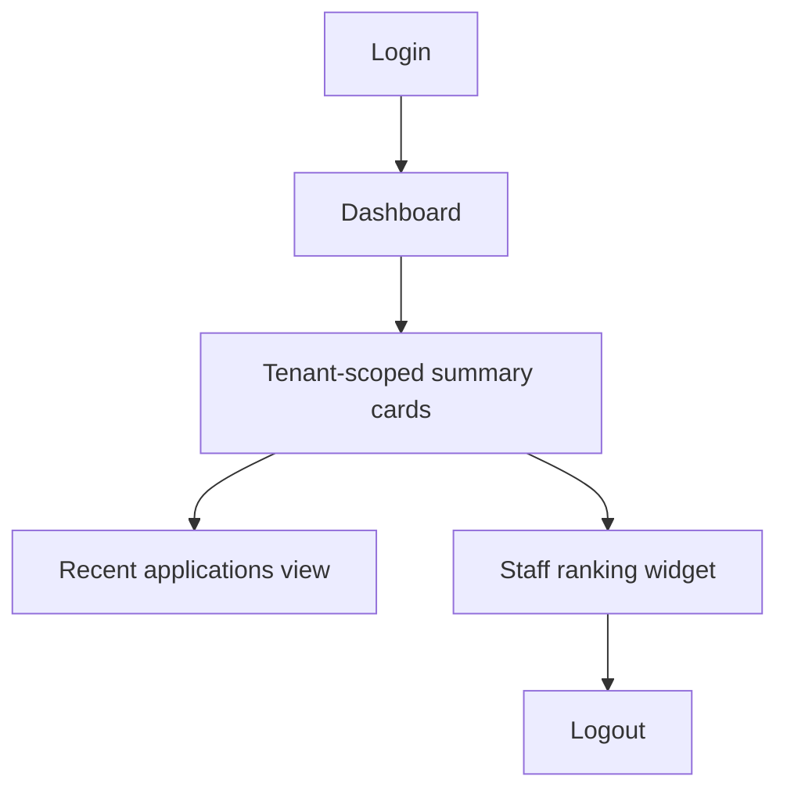
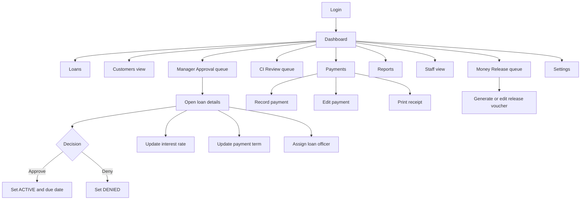
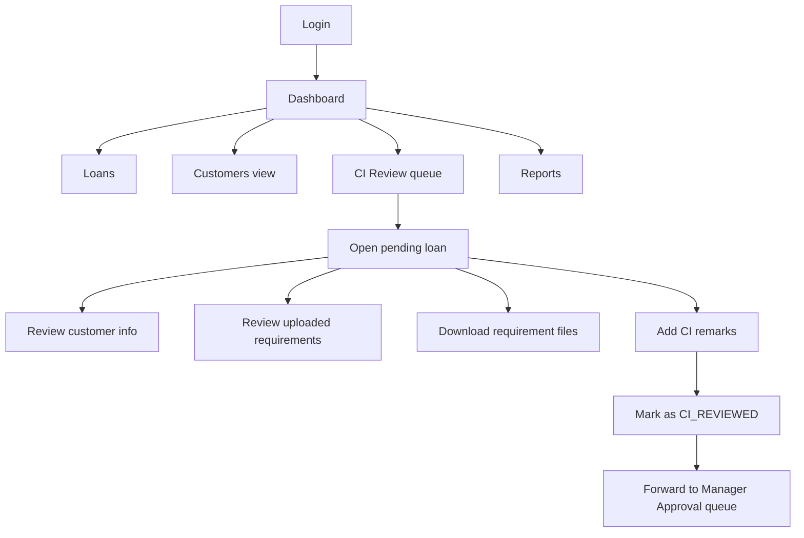
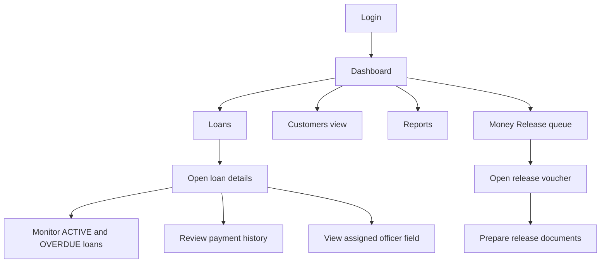
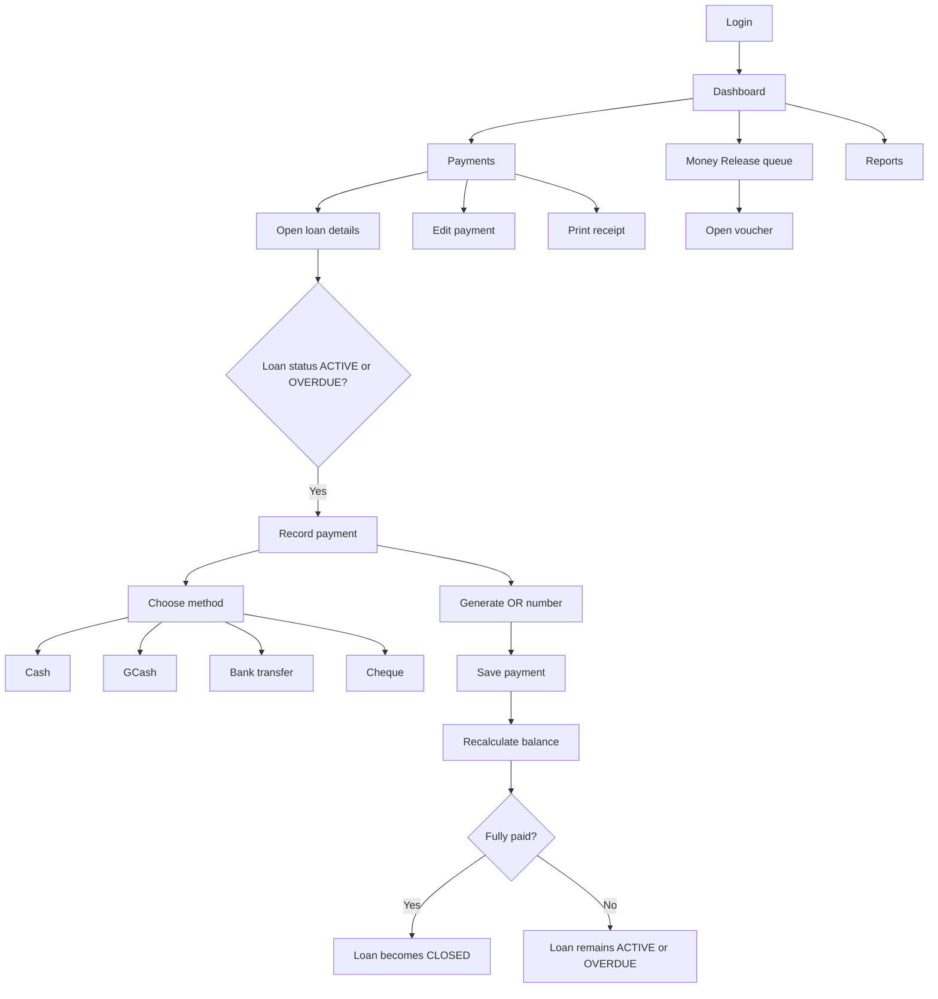
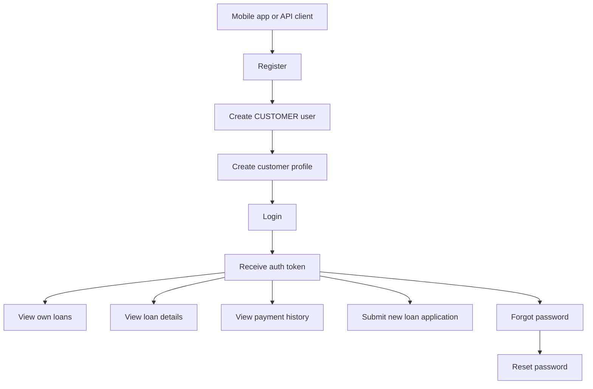

# Role Flowcharts

This document describes the current role flows implemented in this project.

Scope:
- Based on the current PHP code in `includes/auth.php`, `staff/`, and `api/v1/`
- Focused on actual reachable flows, not intended future behavior
- Mermaid diagrams are included so this file can be previewed in Markdown viewers that support Mermaid

## Roles Covered

| Role | Channel | Current State |
| --- | --- | --- |
| `SUPER_ADMIN` | Staff web portal | Full system-wide access |
| `ADMIN` | Staff web portal | Full operational/admin access, effectively system-wide |
| `TENANT` | Staff web portal | Can log in, but permissions are only partially mapped |
| `MANAGER` | Staff web portal | Loan decisions, reports, vouchers, settings |
| `CREDIT_INVESTIGATOR` | Staff web portal | CI review and validation flow |
| `LOAN_OFFICER` | Staff web portal | Loan viewing and operational follow-up |
| `CASHIER` | Staff web portal | Payment processing and receipts |
| `CUSTOMER` | Mobile/API | Registration, login, loan application, payment/history view |

## Overall Loan Lifecycle

## SUPER_ADMIN

Primary flow:

Current capabilities:
- Everything available to `ADMIN`
- System-wide visibility across tenants
- Staff account management
- Tenant registration and activation/deactivation
- History and sales reporting

## ADMIN

Primary flow:

Current capabilities:
- Full operational control
- Customer creation and maintenance
- Staff registration and maintenance
- Tenant registration and status management
- Loan approval chain access

## TENANT

Current-state flow:

Notes:
- `TENANT` can log in and view the dashboard
- In the current permission map, `TENANT` is not granted the normal sidebar permissions
- This means the role is present in the schema/session logic, but not fully wired like the other staff roles

## MANAGER

Primary flow:

Current capabilities:
- Final decision-maker for loan approval
- Can update loan terms
- Can assign loan officers
- Can process vouchers
- Can see reports and settings

## CREDIT_INVESTIGATOR

Primary flow:

Current capabilities:
- Reviews `PENDING` loans
- Verifies requirements and customer details
- Moves applications to `CI_REVIEWED`
- Does not approve or deny the loan

## LOAN_OFFICER

Primary flow:

Current capabilities:
- Can view loans and loan details
- Can participate in voucher/money-release flow
- Can monitor active accounts
- Cannot record payments directly in the current permission map

## CASHIER

Primary flow:

Current capabilities:
- Records payments
- Edits payments
- Prints receipts
- Can work with active/overdue loan collections

## CUSTOMER

Primary mobile/API flow:

Notes:
- Customer access is API/mobile oriented, not the staff web portal
- Implemented endpoints live in `api/v1/auth.php` and `api/v1/loans.php`

## Role-to-Page Summary

| Role | Main Pages / Flow Entry Points |
| --- | --- |
| `SUPER_ADMIN` | Dashboard, Loans, Payments, Reports, Staff, Registration, Tenant Management, Sales, History, Settings |
| `ADMIN` | Dashboard, Customers, Loans, Payments, CI Queue, Manager Queue, Reports, Staff, Registration, Tenant Management, Sales, History, Settings |
| `TENANT` | Dashboard only in current wiring |
| `MANAGER` | Dashboard, Loans, Customers, Payments, CI Queue, Manager Queue, Reports, Staff, Money Release, Settings |
| `CREDIT_INVESTIGATOR` | Dashboard, Loans, Customers, CI Queue, Reports |
| `LOAN_OFFICER` | Dashboard, Loans, Customers, Reports, Money Release |
| `CASHIER` | Dashboard, Payments, Money Release, Reports |
| `CUSTOMER` | API registration, API login, API loans, API payments/history |

## Implementation Notes

- Loan decisions happen in `staff/loan_view.php`
- Customer management happens in `staff/customers.php`
- Staff and tenant registration happens in `staff/registration.php`
- Tenant activation/deactivation happens in `staff/tenant_management.php`
- Payment recording happens in `staff/payment_add.php`
- Voucher flow happens in `staff/release_queue.php` and `staff/release_voucher.php`
- Permission mapping is defined in `includes/auth.php`

